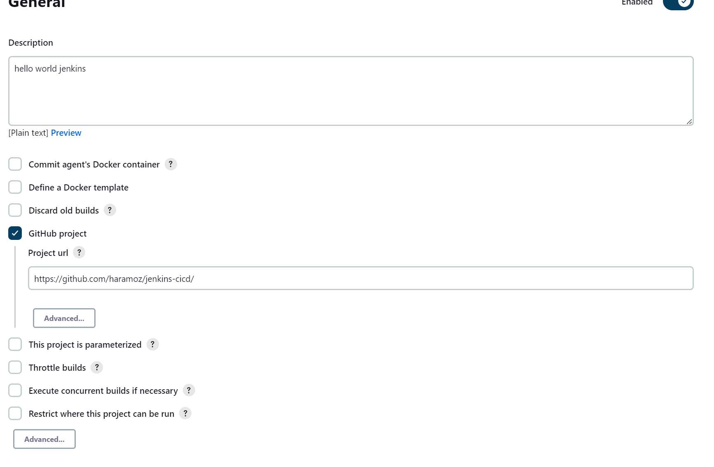

# jenkins-cicd
Testing out Junit test cases with Jenkins CI pipeline

## PipeLine
 

This is the basic concept of developer pushing the code to get it automatically build and deployed in docker hub using Jenkins. Continuous Integration.

Here are the main steps to setup Jenkins pipeline.
- *General* : Description of the pipeline, github project uri
- *Source Code Management*: Git repository and credentials and which branch/es to follow by Jenkins.
- *Build Triggers*: Build Periodically and Poll Scm (follows cron syntax)
- *Build Environment*: If some pre configurations needed
- *Build Steps*: mvn clean package (to build a runnable JAR file, that will be deployed) then using Docker-pipeline plugin create,tag and push image to docker hub (arkamallick namespace).
- *Post-build Actions*: After the build steps is over, update the status in github using status backref. CI complete.

## Dockerize the app
- pom has a spring-boot-maven-plugin plugin configured which takes care of generating a runnable jar
- added Dockerfile

To build & run the docker image:
<pre>docker image build -t docker-jenkins-java-jar:latest . </pre>
Here the snapshot will be repackaged and tagged docker-jenkins-java-jar (because of -t), . at the end signifies the location of the Dockerfile.

<pre> docker run docker-jenkins-java-jar:latest </pre>

### Jenkins Docker plugins
Installed Docker Pipeline. Manage Nodes and Clouds (under manage Jenkins) -> add a cloud -> added Docker there as cloud 

### Docker creds
I have a Docker Hub account, created new access token. Adding the creds in jenkins: 

Dashboard -> Manage Jenkins -> Credentials -> System -> Global credentials (unrestricted)

### Debugging Notes
Docker integration does not work out of the box.
Turns out that the jenkins uses Docker REST Api underneath and needs to be configured. Docker does not allow remote access by deafault and needs to be configured, like this worked.

https://stackoverflow.com/a/60728186/1578967

manage jenkins -> Configure System -> Docker Builder 
Tried the connection to tcp://127.0.0.1:2375 and test Connection worked
Hint: First the docker desktop has to be running and Docker engine is accessible via DD.

# Links 
https://www.jenkins.io/doc/book/installing/kubernetes/

https://phoenixnap.com/kb/how-to-configure-docker-in-jenkins

# Appendix:

Detailed screenshots of the pipeline configuration

